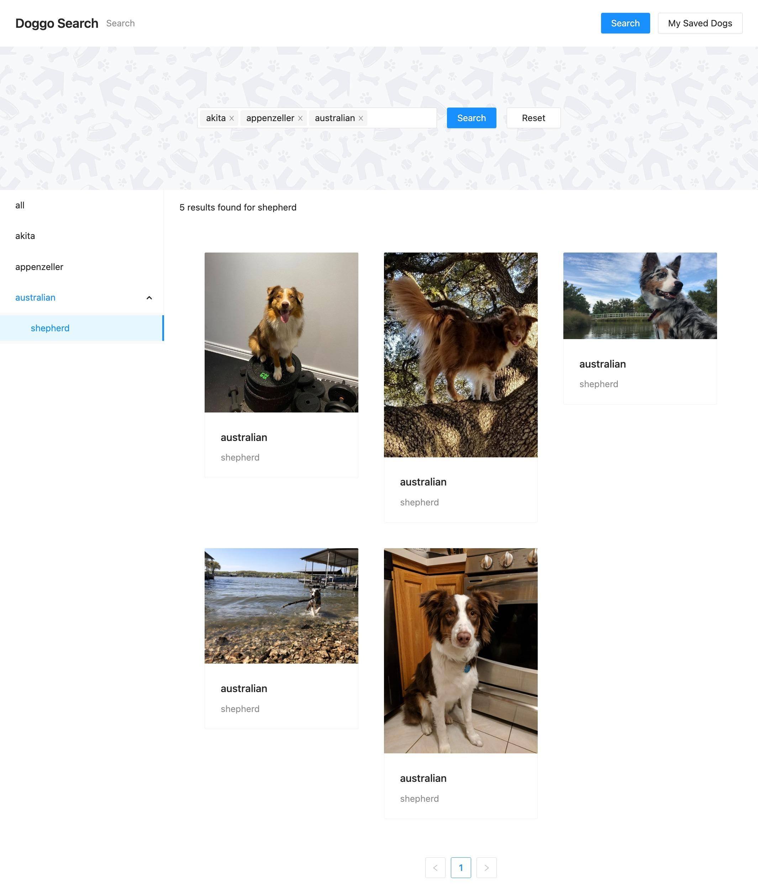

# Dog CEO Search ReactJS Exercise

## Intro

This App was a coding excercise in ReactJS. The main purpose was to use [Ant Design](https://ant.design/) components to build a complex search interface that hits the [Dog CEO](https://dog.ceo/) API. `Promise.all` was used to fetch multiple API routes asynchronously and all results are then merged and then exhibited as one single result.

## Setup

This is a fairly standard ReactJS app to setup. This project was build using Node version 16.13.0, but any newer version should also work as expected.

To start the app, run:

```bash
yarn start
```

## Live preview

[See the live website here](https://richardandreas.github.io/Dog-CEO-Search/)

## App screenshot


