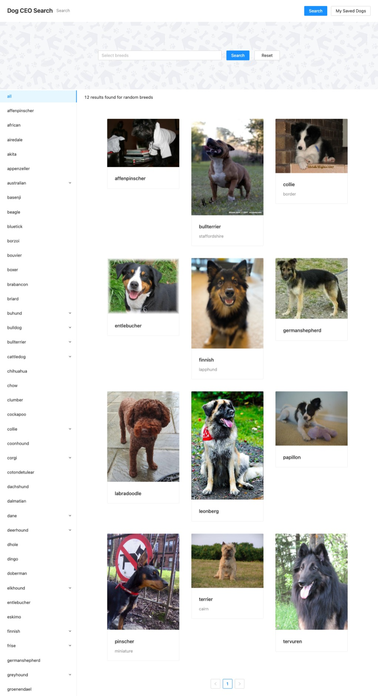

# Hub3 Take-Home Challenge: Doggo Search

Please find the up-to-date challenge instructions and project template here:

https://hub3.com/d/MJrmCT3wNCxAZWXoU2h5KB

## Submitting Questions

### How long did this challenge take you?

I would guess that it took me around 8 hours. I've worked around 2 hours on Thursday and Friday on this challenge, and then 4 more hours on Saturday.

#### What challenges did you face?

By far the hardest part to me was merging the results of multiple dynamic requests together and then render the results as one singe list. This is something I've never implemented before. My solution still has some bugs due to the way I've implemented the "multi request hook". For example, when reloading the page, it dafaults to the 12 random pictures, even having done the state management right (I think).

Another lesser hard part was just getting used to Ant design. I didn't figure out how to make the sidebar re-render on a search. The result is that it's bugging on the default selected nav item. The same applies to the pagination, where the pages don't match the new result after a new search.

#### What would you do differently with more time?

Maybe I wouldn't have created a hook to make multiple requests, although I think that would be one of the most "elegant" solutions if I would have made it work. I think that by not using a hook, fetching search results on page reloads (by the URL query params) wouldn't be bugging as they are right now.

If I had more time I would also continue investigating why those issues are happening that I mentioned. Eventually I would figure out how to fix them.

I've also put in a little effort (probably more than I should have) to make the page look pretty. I could have won some time if I didn't.

#### Is there anything we should take note of as we review this code?

I haven't worked professionally with ReactJS since over a year and a half, so, my architecture might not be up to date with todays standards.

#### Was there anything confusing about this challenge? Anything for us to improve?

I had 2 quesitons where I had to reach out to Brian. They were about merging the results and pagination. Maybe that could have been a little bit clearer. But overall it was a good challenge and I had a fun time doing this.

## Here is a screenshot of the result

